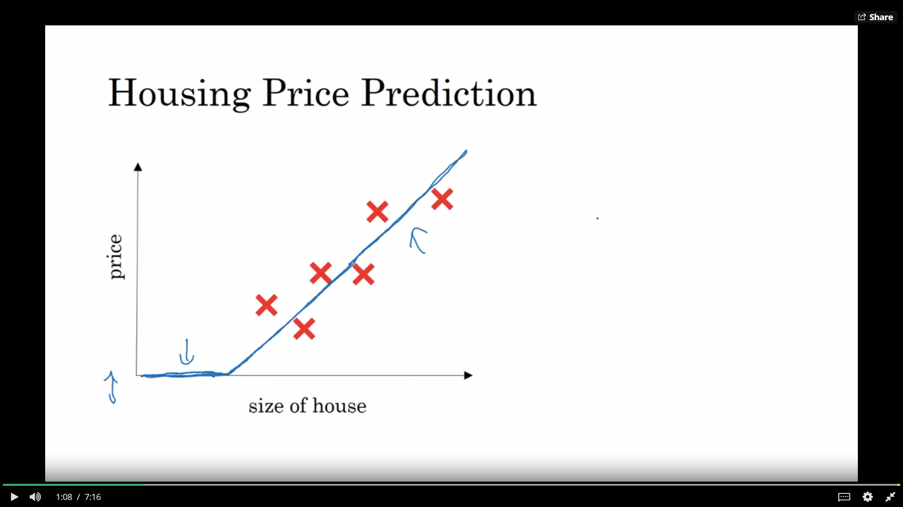
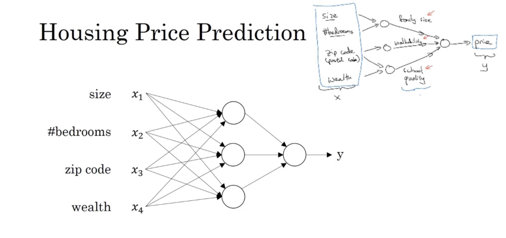

Example of a function: Housing prices given, you need to fit a linear regression model to the graph, but if you extend that line backwards, it will go into -ve, which is not what you want.

So, you reduce the end so that instead of it going to negative, it stays at 0. 

So basically, we have taken the size of the house, we performed an algorithm on it, and we got it's price based on it's size. This algorithm performed is a neuron.

The size was a single input layer and the price was the single output layer. Now you may have multiple input layers, algorithms to predict the outcome/neurons and output layers.

These neural networks are great at supervised learning.

You feed the inputs into the neural network with each input being an individual neuron and you also provide the neural network with the output it needs to generate. In the below example, X and Y are provided by you while the intermediate steps is predicted by the neural network.

