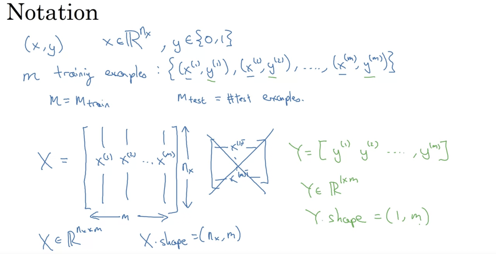

Suppose we have an image of 64x64 pixels. The model will read the image as 3 different images of red, green and blue intensities, each of size 64x64. 

Pixel values are then stored into an input feature vector (1 dimensional). 

We shall be using **m** to donate the training examples. 

